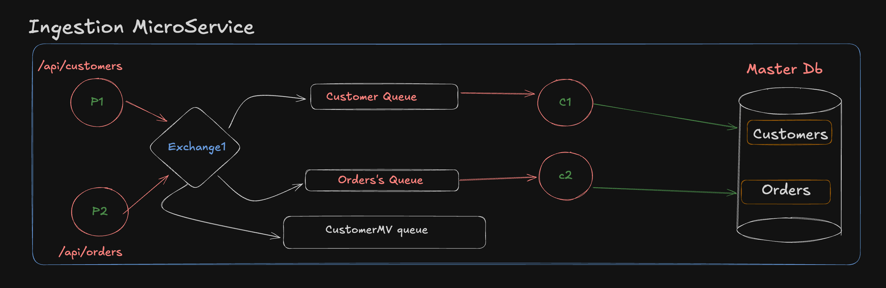
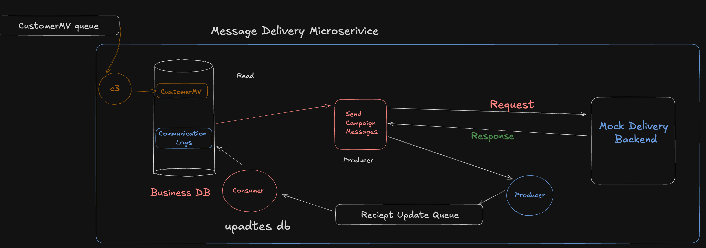
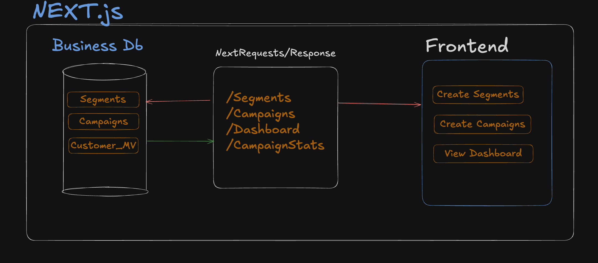
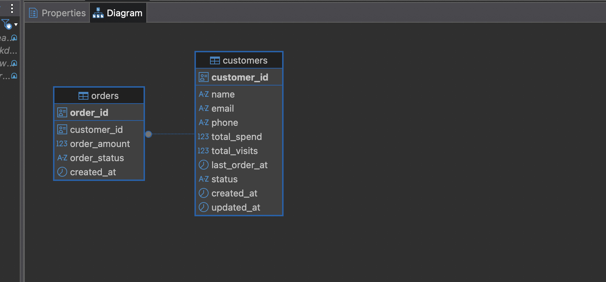
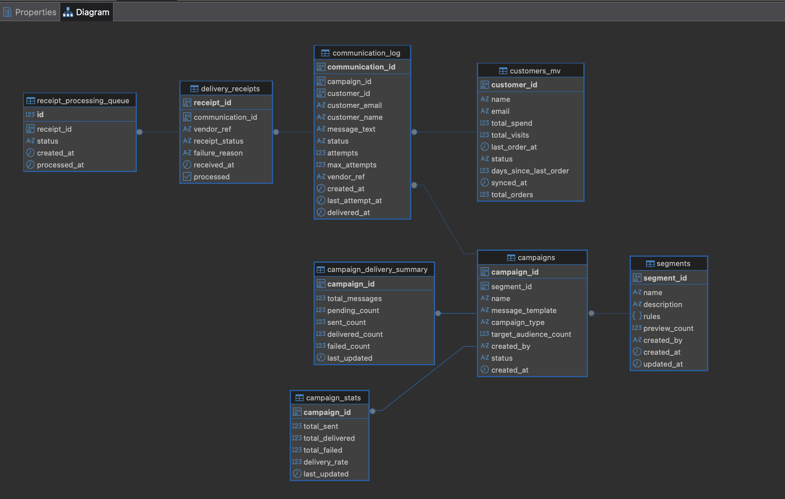

# XenCRM Backend

An end-to-end Customer Relationship Management (CRM) system built as part of the Xeno SDE Internship Assignment – 2025. The project demonstrates modern engineering practices: microservices architecture, event-driven design, full-stack development, and AI-first integrations.

## Architecture Overview

XenCRM follows a microservices architecture with:

### Ingestion Microservice

**Purpose**: Manages customer data, orders, and generates events to update DB

- Provides APIs (/customers, /orders) to add customer & order data.
- Publishes events to RabbitMQ queues (Customer Queue, Orders Queue).
- Master DB stores raw customer & order data.
- Write-Heavy Operations on the Database.
  

### Message Delivery Microservice

**Purpose**: Handles Message delivery for Campaigns, and delivery tracking.

- Reads Communication_Logs from Business DB.
- Sends personalized campaign messages via a Producer → Mock Vendor API.
- Vendor API responds with delivery status (90% success / 10% fail).
- Delivery receipts are pushed to a Receipt Update Queue, consumed to update logs in Business DB.
- Read Heavy Operations on the Database.
  

### Frontend - [LinkToRepo](https://github.com/prateekshukla17/XenCRM_Frontend)

- Authenticated via Google OAuth (NextAuth).
- Provides UI to create segments, create campaigns, and view dashboards.
- Communicates with Campaigns DB via APIs (/segments, /campaigns, /dashboard, /campaignStats).

  

## Architecture Reasoning

Ingestion service (Master DB)

- System of record: strong transactional guarantees for customers & orders.
- Optimized for writes and intergrity.
- Publishes events about state changes.

Functional / Campaign service (Business DB)

- Owns segments, campaigns, communication_log, and a denormalized customer_mv for fast read queries.
- Optimized for complex read queries (segmentation) and campaign delivery.
- Isolated schema means we can evolve it (indexes, materialized views, different DB engine) without touching ingestion.

Why this split:

- separates write/load patterns (write-heavy ingestion vs read-heavy campaign queries)
- Resilience & scalability — decouples producers and consumers so ingestion traffic doesn’t slow down campaigns.

## Technologies Used

- Node.js – Runtime environment.

- Express.js – REST API framework.

- Prisma – ORM for PostgreSQL.

- Model Context Protocol - Exposing APIs to Natural Language.

- PostgreSQL(neonDB) – Primary relational database.

- RabbitMQ – Message broker for event-driven communication.

## Database Schemas

### MasterDB



### BusinessDb



## Project Structure

```
XenCRM_Backend/
├── services/
│   ├── Customer/           # Ingestion (customer/order) service.
│   │   ├── prisma/         # Ingestion database schema
│   │   ├── consumers/      # RabbitMQ message consumers (Orders,Customers)
│   │   ├── controllers/    # API controllers for customer/order APIs
│   │   └── routes/         # API routes
│   └── Campaign/           # Campaign management & messaging service
│       ├── prisma/         # Campaign database schema
│       ├── consumers/      # Message processing consumers
│       ├── services/       # Business logic services
│       └── messagingOrchestrator.js  # Main messaging coordinator
├── shared/
│   ├── database.js         # Multi-database connection manager
│   ├── utils/
│   │   └── rabbitmq.js     # RabbitMQ connection & queue management
│   └── types/
│       └── events.js       # Event type definitions for RabbitMQ events
└── mcp/                    # Model Context Protocol server
    ├── src/                # TypeScript source code
    │   ├── index.ts        # Main MCP server
    │   ├── database.ts     # Database service layer
    │   └── schemas.ts      # Validation schemas
    ├── build/              # Compiled JavaScript
    └── README.md           # MCP server documentation
```
